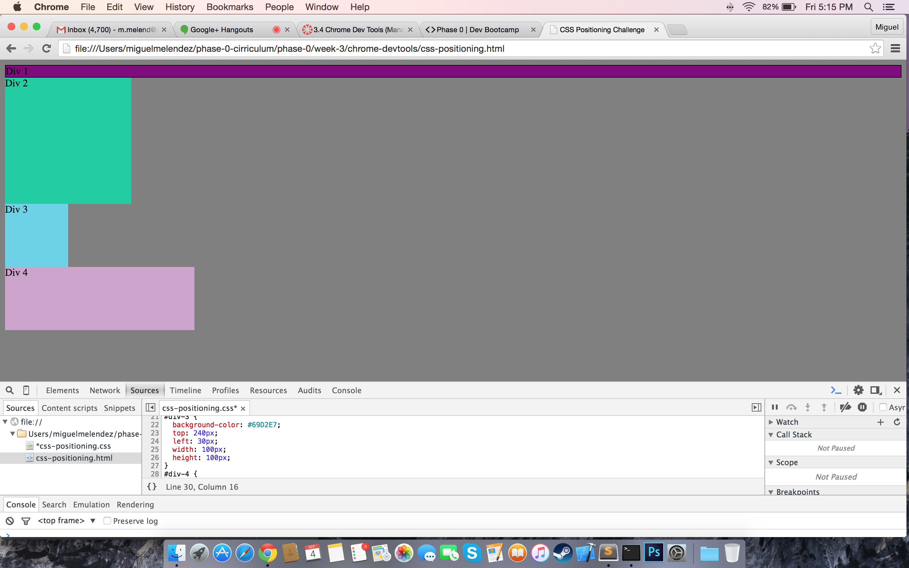
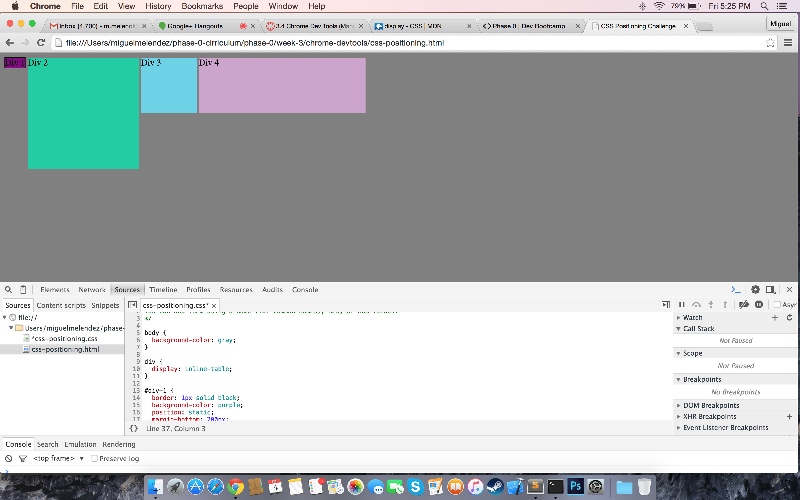
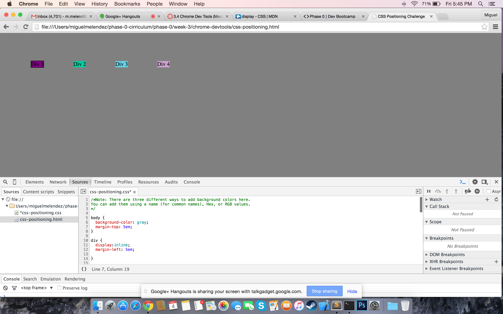
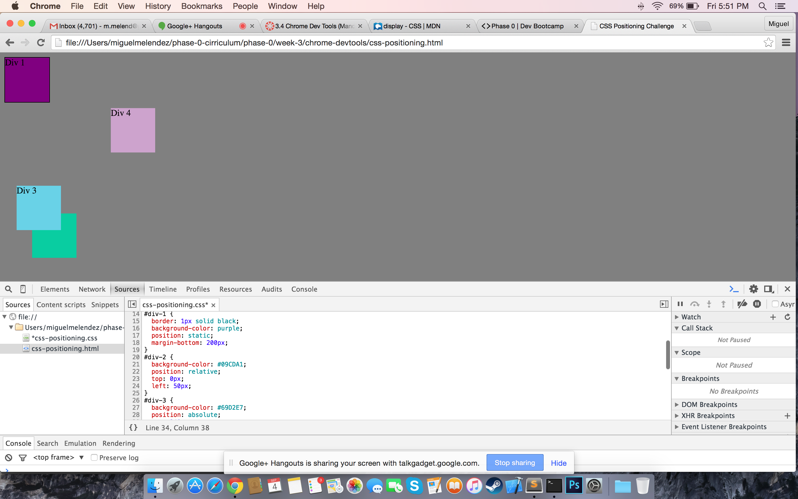
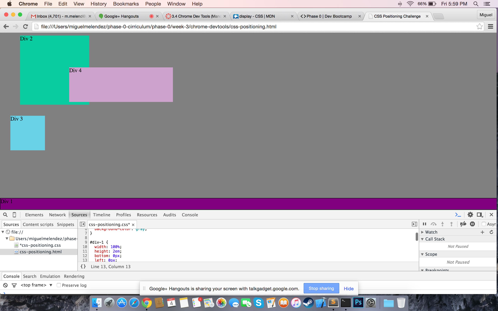
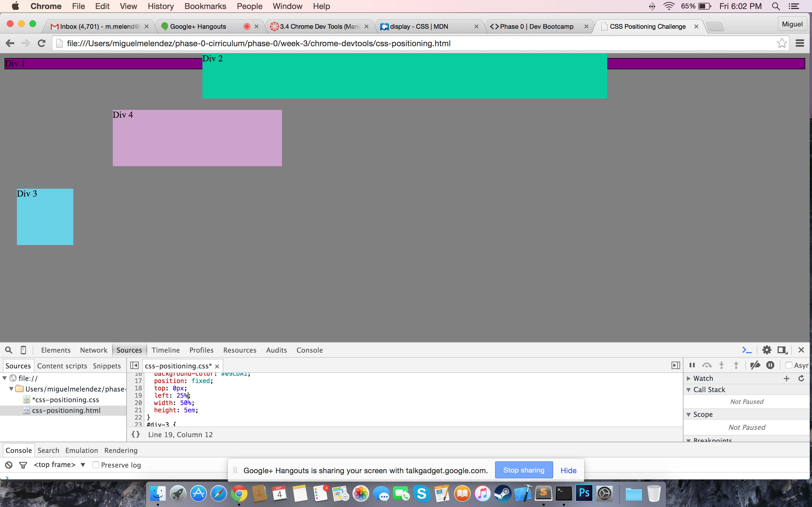
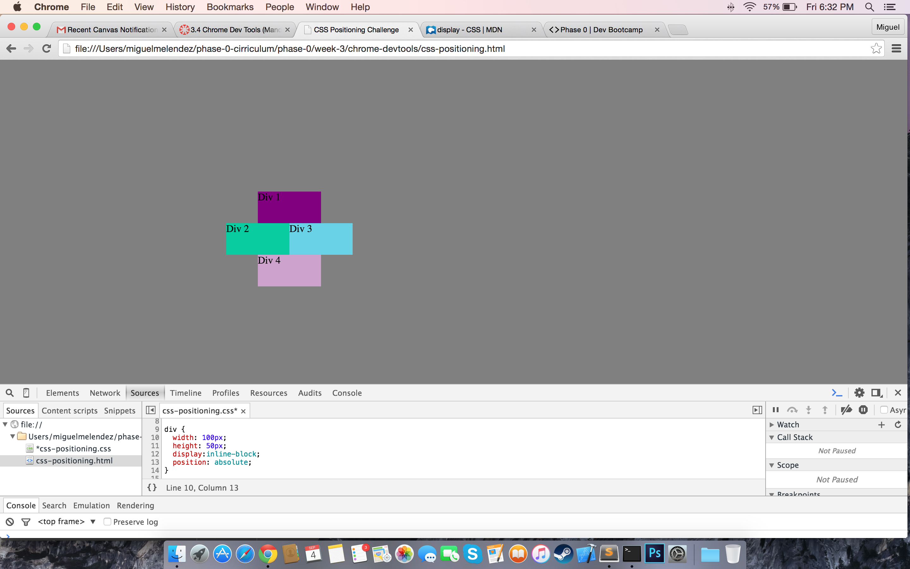

**How can you use Chrome's DevTools inspector to help you format or position elements?**

* You can use chrome dev tools to inspect both the html and css stylesheets on any given page. You can even edit them right from the dev tools and watch the changes happen in real time. This gives you a better grasp on positioning and inhertance.*

**How can you resize elements on the DOM using CSS?**

* Just change or add size propeties to the css.*

**What are the differences between Absolute, Fixed, Static, and Relative positioning? Which did you find easiest to use? Which was most difficult?**

* 
Absolute positions the element in relation to it's containing element. It does not effect the position of other elements.
Fixed positioning is similar to absolute except that it positions in relation to the browser window rather than the containing element.
Static elements sit ontop of one another, it is the normal flow.
Relative shifts the position from where it would be in normal flow, this also does not affect the position of other elements.

I found relative positioning the most difficult to use, although most were tough at first.*

**What are the differences between Margin, Border, and Padding?**

* Margin is the space outside the border of an element. Border is the perimeter or an element. Padding is the space between the border and what the element contains.*

**What was your impression of this challenge overall? (love, hate, and why?)**

* I thought this was a great challenge, it helped to put these different concepts into perspective.*
